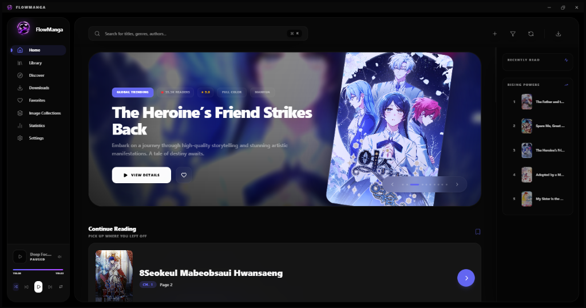
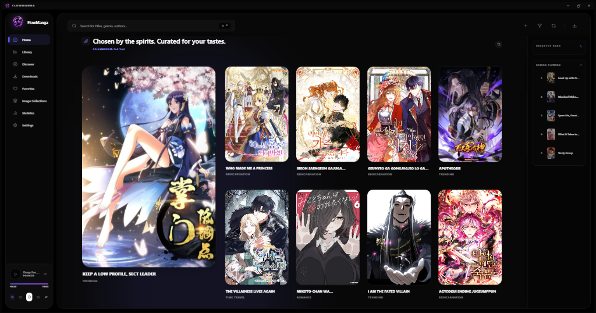
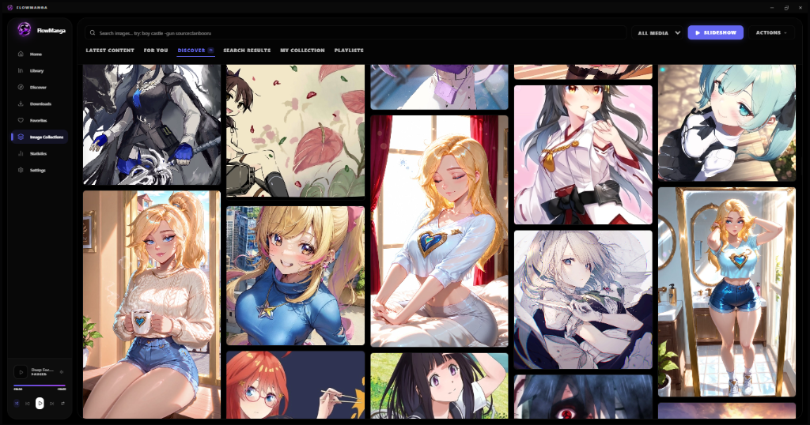

<div align="center">


# FlowManga

**Read. Discover. Flow.**

<div style="display: flex; gap: 10px; margin-bottom: 20px;">
  
  
  
</div>

[](LICENSE)
[](https://react.dev/)
[](https://tauri.app/)
[](https://www.typescriptlang.org/)

FlowManga is a local-first Tauri 2 desktop application for reading, organizing, downloading, and discovering manga and visual media. Its React interface combines a local library, multiple reader layouts, federated source search, image and video collections, recommendations, playlists, and reading analytics.

[Features](#features) · [Installation](#installation) · [Source access](#source-access-and-safety) · [Development](#development-and-release-checks) · [Roadmap](#roadmap)

</div>

---

## Features

### Library and collections

- Scan local manga and media folders without moving the original files.
- Import supported URLs and download chapters to a user-selected location.
- Browse grid, shelf, smart album, playlist, favorites, recent, and uncategorized views.
- Filter federated results by image, GIF, or video media type.
- Search and navigate quickly with the command palette and keyboard shortcuts.

### Reader and viewer

- Vertical webtoon, single-page, and dual-page reading layouts.
- Zoom, fit, fullscreen, HUD, auto-scroll, and shortcut controls.
- Slideshows with auto-advance, shuffle, and looping.
- Local and remote image, GIF, and video playback.
- Optional adaptive page colors and ambient soundscapes.

### Discovery and recommendations

- Latest, Discover, Search, and configurable For You feeds.
- Editable recommendation themes with core, secondary, excluded, artist, character, and series tags.
- Adult-only themes and suggestions remain hidden while Adult Content is disabled.
- Sankaku For You mixes recent and randomized matching posts to reduce repetition.
- Seen-history ranking, blocked tags, source balancing, and related-post grouping.

### Sources and downloads

- MangaDex API support plus scraper-backed manga and comic providers.
- Federated visual-media support for Danbooru, Gelbooru, Rule34, E-Hentai, Sankaku Complex, Nekos.best, and other configured providers.
- Source-aware tag autocomplete, typed tags, exclusions, and media filtering.
- Shared Sankaku image and Books authentication with session verification.
- Download queue with pause, resume, retry reporting, cleanup, and native image processing.
- Per-source request spacing, retry policy, schedules, live status, and sanitized diagnostics.

### Reliability, privacy, and maintenance

- Numbered transactional database migrations with an automatic pre-migration backup.
- Full library/settings export and restore, plus password-encrypted device-transfer packages.
- Exact and perceptual duplicate detection, missing-file checks, and download-integrity repair tools.
- Structured troubleshooting logs with secret and local-path redaction.
- First-run setup for library folders, download location, content safety, and enabled sources.

### Desktop integration

- Tauri filesystem, SQL, dialog, shell, HTTP, and native window integrations.
- Local SQLite metadata while original library files stay in place.
- Windows NSIS release builds through the tagged GitHub Actions workflow.
- Native update checks and versioned GitHub release notes.

---

## Source access and safety

FlowManga does not bypass provider account, premium, or visibility requirements. Some providers expose public catalogs but require a valid captured session for restricted media. Source Settings contains authentication, cookie capture, and session-verification controls where supported.

Adult Content is disabled by default. While disabled, FlowManga filters provider ratings, built-in adult themes, adult tag suggestions, and known adult terminology. User-defined tags remain stored when the setting changes, but safe-mode filtering controls what is requested and displayed.

Only access and download material you are authorized to use. Provider availability and API behavior can change independently of FlowManga.

---

## Tech stack

| Layer | Stack |
| --- | --- |
| UI | React 19, Framer Motion, Tailwind CSS 4, Lucide |
| State and data | Zustand, SQLite |
| Lists and charts | react-window, Recharts |
| Desktop | Tauri 2, Rust, Vite 7 |
| Validation | TypeScript, ESLint, Clippy |

---

## Installation

### Windows release

Download the current Windows installer from [GitHub Releases](https://github.com/Djonluc/flowmanga/releases). Updating preserves the existing library database and settings.

### Build from source

Prerequisites:

- Node.js 18 or newer (current LTS recommended)
- Rust stable with the Tauri prerequisites for your operating system
- Windows WebView2 when building or running on Windows

```bash
git clone https://github.com/Djonluc/flowmanga.git
cd flowmanga
npm ci
npm run tauri dev
```

Create a production build with:

```bash
npm run tauri build
```

The configured release bundle target is Windows NSIS. Source builds may run on other Tauri-supported platforms, but official release artifacts depend on the configured workflow and target.

### Environment

Copy `.env.example` to `.env` only when non-default scraper behavior is required. Never commit session cookies, API keys, or access tokens.

---

## Development and release checks

```bash
npm ci
npm run typecheck
npm run lint:a11y
npm test
npm run vite-build
cargo test --manifest-path src-tauri/Cargo.toml
cargo clippy --manifest-path src-tauri/Cargo.toml -- -D warnings
```

CI runs TypeScript, frontend tests, the production Vite build, Rust tests, Clippy, dependency auditing, bundled-audio verification, a desktop startup smoke check, and release checksum generation. The audited interaction surfaces also pass the accessibility rules for labels, keyboard operation, focus, media alternatives, and dialog behavior. See [DEPLOYMENT.md](DEPLOYMENT.md) for the tag-driven Windows publishing process.

---

## Project structure

```text
flowmanga/
├── assets/                  # Bundled audio and other application assets
├── public/                  # Branding, screenshots, and public web assets
├── src-tauri/               # Rust backend, capabilities, icons, and bundle config
├── src/
│   ├── components/          # Application UI
│   ├── hooks/               # Media, reader, library, and utility hooks
│   ├── image-platform/      # Federated visual-media engine and collections
│   ├── services/            # Downloads, discovery, sources, and automation
│   ├── stores/              # Zustand application stores
│   └── types/               # Shared TypeScript types
├── CHANGELOG.md
├── DEPLOYMENT.md
├── RELEASE_NOTES.md
└── package.json
```

---

## Roadmap

- Continue reducing legacy type and hook debt directory by directory.
- Expand provider fixtures and installed-Windows UI smoke coverage.
- Improve reader performance for very long chapters and large local libraries.
- Expand touch and gesture support.
- Explore opt-in hosted synchronization in addition to encrypted manual device transfer.

---

## License

[MIT](LICENSE)

---

<div align="center">

### Created by **DjonStNix**

[](https://github.com/Djonluc)
[](https://www.youtube.com/@Djonluc)
[](mailto:djonstnix@gmail.com)

**Version:** 2.5.7 · **Status:** active development

</div>
